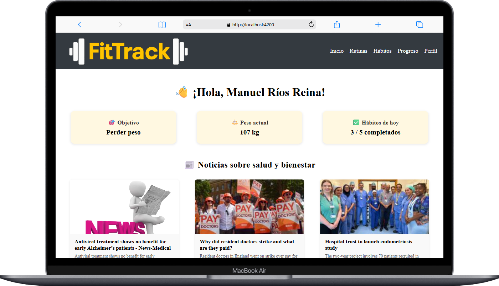
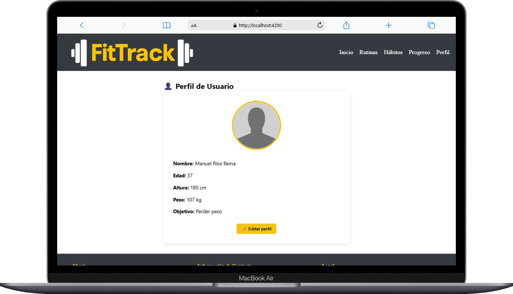
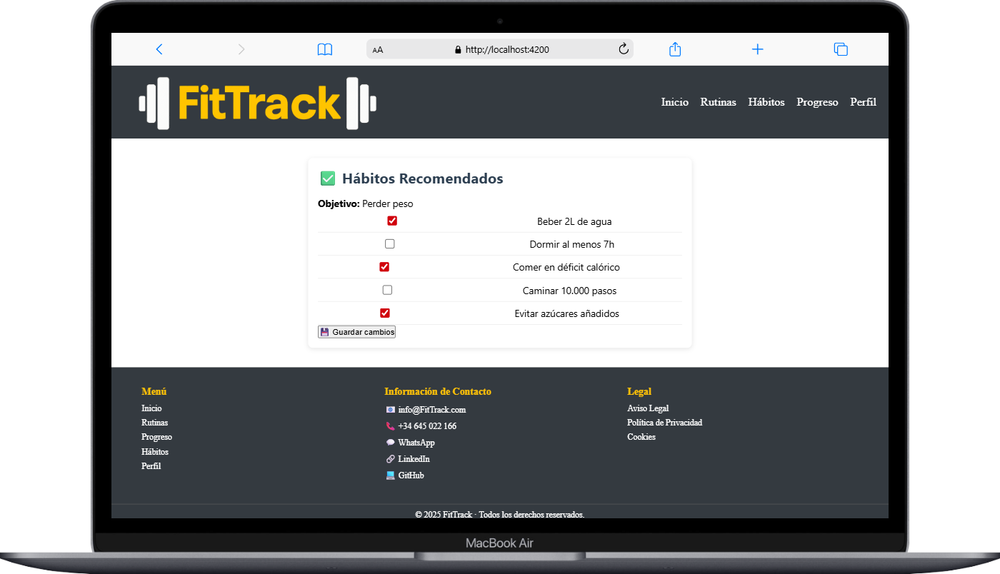

# 🏋️‍♂️ FitTrack - Tu guía diaria de hábitos y bienestar

**FitTrack** es una aplicación web desarrollada con **Angular** cuyo objetivo es ayudar a los usuarios a llevar un seguimiento de sus hábitos saludables, rutinas de ejercicio, peso y progreso físico, todo desde un panel intuitivo. Además, incluye un módulo de noticias actualizadas sobre salud y bienestar para mantenerte informado.

---

## 🚀 Funcionalidades

### 🎯 Dashboard

- Vista general con:
  - Objetivo del usuario.
  - Peso actual.
  - Progreso de hábitos diarios (x / y completados).
- Accesos rápidos a secciones clave.
- Noticias de salud y bienestar integradas desde una API externa (MediaStack).

### ✅ Gestión de Hábitos

- Crear, marcar y guardar hábitos diarios.
- Persistencia diaria mediante `localStorage`.
- Visualización del progreso diario en el dashboard.

### 📅 Rutinas

- (Funcionalidad prevista) Planificación de rutinas de ejercicio.
- Acceso rápido desde el panel principal.

### 📈 Seguimiento de Progreso

- Resumen de métricas personales.
- (Futuro) Visualización gráfica del progreso de peso, hábitos, etc.

### 👤 Perfil de Usuario

- Datos almacenados en `localStorage`:
  - Nombre
  - Peso
  - Objetivo personal

---

## 📌 Casos de Uso

| Usuario          | Acción                   | Resultado                                                 |
| ---------------- | ------------------------ | --------------------------------------------------------- |
| Nuevo usuario    | Completa su perfil       | Se guarda localmente                                      |
| Usuario habitual | Marca hábitos diarios    | Se almacena con la fecha actual y aparece en el dashboard |
| Usuario curioso  | Revisa noticias de salud | Noticias obtenidas desde una API externa                  |
| Usuario avanzado | Navega entre secciones   | Accede rápidamente a hábitos, rutinas y progreso          |

---

## 🗂️ Estructura del Proyecto

```
src/
├── app/
│   ├── components/
│   │   ├── dashboard/
│   │   ├── habits/
│   │   ├── routines/
│   │   ├── progress/
│   │   └── profile/
│   ├── services/
│   │   └── news.service.ts      ← API externa para noticias
│   ├── app.component.ts
│   ├── app.routes.ts
│   └── app.module.ts
```

---

## 🌐 API de Noticias

Se utiliza la API de [MediaStack](https://mediastack.com/) para obtener las últimas noticias de salud:

- Categoría: `health`
- Idioma: `es`
- Límite: 5 noticias
- Ejemplo de llamada:

```
GET https://api.mediastack.com/v1/news?access_key=TU_API_KEY&languages=es&categories=health&limit=5
```

> 🔐 La clave de API se mantiene en el servicio `news.service.ts`. No exponerla públicamente en producción.

---

## 🛠️ Tecnologías Usadas

- [Angular](https://angular.io/)
- TypeScript
- HTML5 + SCSS
- LocalStorage API
- MediaStack API

---

## 🧪 Próximas Mejoras

- [ ] Integración con Firebase para almacenamiento en la nube.
- [ ] Módulo de rutinas con lógica completa.
- [ ] Estadísticas y gráficas con [Chart.js](https://www.chartjs.org/).
- [ ] Exportación de progresos (PDF/CSV).

---

## 👨‍💻 Autor

**Manuel Ríos Reina**

> Proyecto académico/personal con fines de aprendizaje y desarrollo.

---

## 📸 Capturas





---

## 📄 Licencia

MIT License - Libre uso, modificación y distribución con fines no comerciales.
